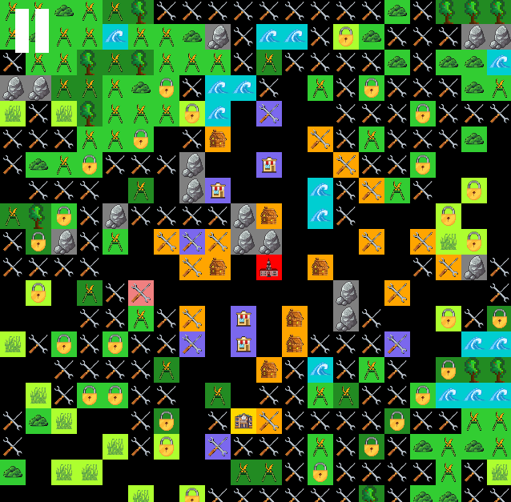
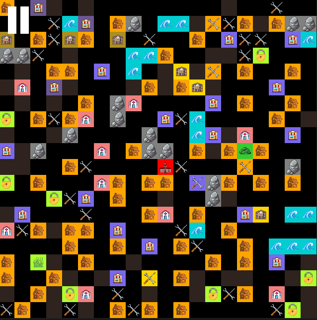

# SoftwareProject

<p align="center">
  
  
</p>


## Prérequis
- java JDK 21
- intelliJ IDEA
-  maven
## Utilisation du projet
Installer les dépendances du projet :

```mvn clean install```
## Structure du projet 
Le projet contient 2 modules : 
- Library
  - Librairie des fonctionnalités, règles d'une simulation de construction de ville.
  - Agents : Batiments, Routes
  
- Simulator
  - Module contenant la simulation de la construction de ville
  - Utilise les fonctionnalités définies dans la librairie


## Lancer la simulation
### Depuis le projet
Dans le module Simulator, la classe DesktopLauncher est le point d'entrée du lancement du programme.
- Simulator/src/main/java/org.multiagent_city/DesktopLauncher
### Depuis le fichier jar 
Double clic sur le fichier jar situé au chemin ci-dessous
- Simulator/target/Simulator-1.0-SNAPSHOT-jar-with-dependencies.jar

Ou dans : 
- Fichier donné séparé du projet

## Développeurs
Boudiaf Yasmine &
Vraie Louis &
Di Placido Anna
